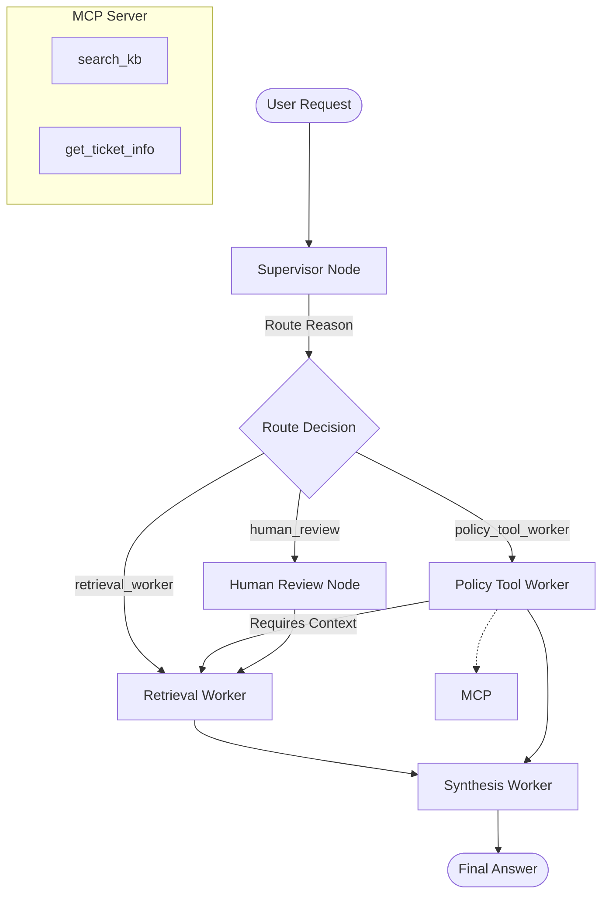

# System Architecture — Lab Day 09

**Nhóm:** ___________  
**Ngày:** ___________  
**Version:** 1.0

---

## 1. Tổng quan kiến trúc

> Mô tả ngắn hệ thống của nhóm: chọn pattern gì, gồm những thành phần nào.

**Pattern đã chọn:** Supervisor-Worker  
**Lý do chọn pattern này (thay vì single agent):**
Kiến trúc Supervisor-Worker giúp tách biệt các trách nhiệm (separation of concerns). Supervisor tập trung vào việc hiểu ý định người dùng và điều phối, trong khi các Worker tập trung vào các nhiệm vụ chuyên biệt như truy xuất (Retrieval), kiểm tra chính sách (Policy/Tools), và tổng hợp (Synthesis). Điều này giúp hệ thống dễ dàng mở rộng, gỡ lỗi và kiểm soát chất lượng phản hồi tốt hơn so với một Agent duy nhất làm tất cả mọi việc.

---

## 2. Sơ đồ Pipeline

> Vẽ sơ đồ pipeline dưới dạng text, Mermaid diagram, hoặc ASCII art.
> Yêu cầu tối thiểu: thể hiện rõ luồng từ input → supervisor → workers → output.

**Ví dụ (ASCII art):**
```
User Request
     │
     ▼
┌──────────────┐
│  Supervisor  │  ← route_reason, risk_high, needs_tool
└──────┬───────┘
       │
   [route_decision]
       │
  ┌────┴────────────────────┐
  │                         │
  ▼                         ▼
Retrieval Worker     Policy Tool Worker
  (evidence)           (policy check + MCP)
  │                         │
  └─────────┬───────────────┘
            │
            ▼
      Synthesis Worker
        (answer + cite)
            │
            ▼
         Output
```

**Sơ đồ thực tế của nhóm:**



---

## 3. Vai trò từng thành phần

### Supervisor (`graph.py`)

| Thuộc tính | Mô tả |
|-----------|-------|
| **Nhiệm vụ** | Phân tích câu hỏi, quyết định worker tiếp theo, gắn cờ rủi ro (risk) và nhu cầu sử dụng công cụ (tool). |
| **Input** | `AgentState` chứa `task`. |
| **Output** | `supervisor_route`, `route_reason`, `risk_high`, `needs_tool`. |
| **Routing logic** | Dựa trên keyword matching (hoàn tiền, cấp quyền, SLA, P1...) để phân loại. |
| **HITL condition** | Khi có mã lỗi không rõ (`err-`) đi kèm rủi ro cao. |

### Retrieval Worker (`workers/retrieval.py`)

| Thuộc tính | Mô tả |
|-----------|-------|
| **Nhiệm vụ** | Truy xuất các đoạn văn bản liên quan từ ChromaDB bằng Vector Search (Dense). |
| **Embedding model** | `all-MiniLM-L6-v2` via `SentenceTransformer`. |
| **Top-k** | Default 3. |
| **Stateless?** | Yes |

### Policy Tool Worker (`workers/policy_tool.py`)

| Thuộc tính | Mô tả |
|-----------|-------|
| **Nhiệm vụ** | Kiểm tra các quy tắc/ngoại lệ chính sách và gọi các công cụ MCP nếu cần thông tin bổ sung. |
| **MCP tools gọi** | `search_kb`, `get_ticket_info`. |
| **Exception cases xử lý** | Flash Sale, Digital products, Activated products, Temporal scoping (v3 vs v4). |

### Synthesis Worker (`workers/synthesis.py`)

| Thuộc tính | Mô tả |
|-----------|-------|
| **LLM model** | `gpt-4o-mini`. |
| **Temperature** | 0.1 |
| **Grounding strategy** | Đưa chunks và policy result vào prompt, bắt buộc trích dẫn [tên_file]. |
| **Abstain condition** | Trả lời "Không đủ thông tin" nếu context trống hoặc không liên quan. |

### MCP Server (`mcp_server.py`)

| Tool | Input | Output |
|------|-------|--------|
| search_kb | query, top_k | chunks, sources |
| get_ticket_info | ticket_id | ticket details |
| check_access_permission | access_level, requester_role | can_grant, approvers |
| ___________________ | ___________________ | ___________________ |

---

## 4. Shared State Schema

> Liệt kê các fields trong AgentState và ý nghĩa của từng field.

| Field | Type | Mô tả | Ai đọc/ghi |
|-------|------|-------|-----------|
| task | str | Câu hỏi đầu vào | supervisor đọc |
| supervisor_route | str | Worker được chọn | supervisor ghi |
| route_reason | str | Lý do route | supervisor ghi |
| retrieved_chunks | list | Evidence từ retrieval | retrieval ghi, synthesis đọc |
| policy_result | dict | Kết quả kiểm tra policy | policy_tool ghi, synthesis đọc |
| mcp_tools_used | list | Tool calls đã thực hiện | policy_tool ghi |
| final_answer | str | Câu trả lời cuối | synthesis ghi |
| confidence | float | Mức tin cậy | synthesis ghi |
| ___________________ | ___________________ | ___________________ | ___________________ |

---

## 5. Lý do chọn Supervisor-Worker so với Single Agent (Day 08)

| Tiêu chí | Single Agent (Day 08) | Supervisor-Worker (Day 09) |
|----------|----------------------|--------------------------|
| Debug khi sai | Khó — không rõ lỗi ở đâu | Dễ hơn — test từng worker độc lập |
| Thêm capability mới | Phải sửa toàn prompt | Thêm worker/MCP tool riêng |
| Routing visibility | Không có | Có route_reason trong trace |
| ___________________ | ___________________ | ___________________ |

**Nhóm điền thêm quan sát từ thực tế lab:**

_________________

---

## 6. Giới hạn và điểm cần cải tiến

> Nhóm mô tả những điểm hạn chế của kiến trúc hiện tại.

1. ___________________
2. ___________________
3. ___________________
